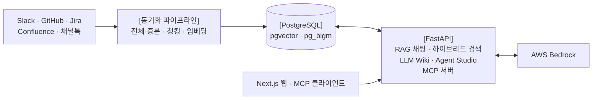

# CatchUp

팀의 기억이 사라지지 않도록, 흩어진 대화와 문서를 한곳에서 찾고 물어볼 수 있는 기업용 AI 지식 플랫폼입니다.

Slack, GitHub, Jira, Confluence, 채널톡의 데이터를 지속적으로 동기화해 하나의 지식 저장소로 관리합니다.

## 주요 기능

- **데이터 동기화**
  - Slack, GitHub, Jira, Confluence, 채널톡의 기존 내용을 처음에 모두 가져온 뒤, 새로 생기거나 바뀐 내용만 계속 반영합니다.
  - 전체 동기화에서는 소스별 어댑터가 API를 페이지 단위로 읽습니다. 원문은 버전별로 저장하고, 청킹과 임베딩을 거쳐 벡터 인덱스에 적재합니다.
  - 증분 동기화에서는 웹훅 이벤트와 폴링으로 변경 사항을 받아 Redis Stream에 쌓고, 워커가 consumer group 단위로 가져가 처리합니다. 실패한 작업은 dead letter로 분리한 뒤 복구 러너가 다시 시도합니다. 전체 동기화가 진행되는 동안에는 증분 동기화를 막아 두 작업이 충돌하지 않습니다.
- **Agentic RAG 채팅 시스템**
  - 자연어로 질문하면 팀의 대화와 문서를 근거로 삼아 출처와 함께 답변합니다.
  - LangGraph의 supervisor가 질문을 direct answer·clarify·simple·standard·complex의 다섯 경로로 분류합니다.
  - standard와 complex 경로에서는 ReAct 에이전트가 여러 단계의 검색과 추론을 반복하며 복잡하고 다층적인 질문에 대응합니다.
  - Redis Streams 기반 재개 가능한 SSE 방식으로 에이전트의 검색 과정과 답변 토큰을 실시간으로 스트리밍합니다.
- **하이브리드 검색**
  - 의미가 비슷한 문서와 정확한 키워드가 들어간 문서를 함께 찾습니다.
  - pgvector HNSW 벡터 검색과 pg_bigm 인덱스 기반 한국어 전문 검색을 병렬 실행한 뒤, 결과를 Weighted RRF(Reciprocal Rank Fusion)로 합칩니다.
  - 검색 루프가 종료되면 리랭커가 사용자 질문에 관련 있는 문서를 중심으로 검색 순위를 다시 매깁니다.
  - LLM이 재작성된 사용자 질문으로부터 키워드를 추출하고 벡터 검색어를 생성합니다.
  - 맥락에 따라 LLM이 기간과 출처 필터도 동적으로 설정해 검색 커버리지를 정밀하거나 폭넓게 적용합니다.
- **LLM Wiki**
  - 사용자가 Wiki의 목적과 원하는 데이터 소스를 지정하면 주기적으로 새로운 위키 문서를 생성하거나 변경안을 제안하고, 사람에게 검토를 요청합니다.
  - 원문 수집 → 정규화 → 사실 추출 → 엔티티 동일성 해소 및 규칙 기반 모순 탐지 → 변경 계획 생성 → 문서 컴파일 → 사람 검토 순으로 진행됩니다.
- **Agent Studio**
  - 이벤트가 발생하면 정해진 작업을 자동으로 수행하는 에이전트를 만들고 실행합니다.
  - 웹훅을 트리거로 실행할 에이전트를 정의하고 검색·조회 도구를 연결해 실행 엔진(harness)에서 구동합니다.
- **채널톡 문의 대응 초안 생성 자동화**
  - 채널톡으로 들어온 고객 문의를 분석해 참고 자료를 바탕으로 응대 초안을 만들고, Slack으로 담당자에게 전달합니다.
  - 먼저 문의와 비슷한 채널톡 상담 사례를 검색하고, LLM이 해당 사례를 답변에 재활용할 수 있는지 평가합니다. 적합한 사례가 없으면 전체 지식 저장소를 다시 검색하고 리랭킹한 뒤 응대 초안과 근거를 생성해 Slack으로 보냅니다.
- **MCP 서버**
  - Claude Desktop이나 Claude Code 같은 외부 AI 도구에서 CatchUp의 하이브리드 검색을 MCP tool로 호출해, 여러 협업 도구에 흩어진 지식을 한 번에 찾을 수 있습니다.
  - Streamable HTTP 전송 방식으로 문서 요약 검색(search_document)·원문 조회(read_document)를 제공합니다.
- **관리자 콘솔**
  - 커넥터 연결 상태, 멤버와 권한, 질문 로그, 토큰 사용량, 감사 로그를 관리할 수 있습니다.

## 커넥터 연동 현황

| 소스 | 수집 대상 |
| --- | --- |
| Slack | 채널 메시지, 스레드 답글, 공유 파일, 첨부 콘텐츠 |
| GitHub | 이슈, 이슈 코멘트, PR, PR 커밋 메시지, PR 리뷰, PR 리뷰 코멘트 |
| Jira | 이슈, 에픽, 코멘트, 연결된 이슈 요약, 첨부파일 정보 |
| Confluence | 페이지, 블로그 글, 인라인 코멘트, 하단 코멘트 |
| 채널톡 | 고객 상담 대화, 상담 메시지, 도큐먼트 아티클 |

모든 소스는 처음 한 번 전체 동기화를 마친 뒤, 웹훅과 폴링을 이용한 증분 동기화로 최신 상태를 유지합니다.

## 아키텍처



- 수집한 원문과 메타데이터는 PostgreSQL에 저장하고, pgvector와 pg_bigm 인덱스로 벡터 검색과 한국어 전문 검색을 처리합니다.
- Redis Streams는 동기화 이벤트 큐로, 그 외 Redis 키는 캐시로 사용합니다.
- LLM 호출과 검색 과정은 Langfuse 트레이스와 구조화 로그로 기록합니다.

## 기술 스택

**Backend**

| 영역 | 구성 |
| --- | --- |
| 런타임 | Python 3.12, FastAPI + Uvicorn, Pydantic v2 |
| 데이터 접근 | SQLAlchemy, Alembic 마이그레이션, psycopg |
| LLM 오케스트레이션 | LangGraph(상태 그래프, 비동기 PostgreSQL 체크포인터), LangChain(OpenAI · AWS · Cohere · Postgres), Jinja2 프롬프트 템플릿 |
| 모델 | LLM: OpenAI, AWS Bedrock(Claude) · 임베딩: Cohere, OpenAI, Bedrock · 리랭커: Cohere, Bedrock |
| 커넥터 | slack-sdk, githubkit, Atlassian REST API(Jira · Confluence), 채널톡 Open API, 웹훅 서명 검증과 OAuth 토큰 관리(cryptography, PyJWT) |
| 비동기 처리 | Redis Streams 기반 워커, APScheduler 폴링 |
| MCP | 공식 `mcp` SDK, Streamable HTTP 서버 |
| 관측성 · 평가 | Langfuse 트레이싱, structlog 구조화 로그, Ragas 평가 |
| 테스트 | pytest |
| 도구 | uv, ruff |

**Data**

| 영역 | 구성 |
| --- | --- |
| 주 저장소 | PostgreSQL 17 |
| 벡터 검색 | pgvector, HNSW 인덱스 |
| 전문 검색 | pg_bigm(한국어 bigram 인덱스) |
| 큐 · 캐시 | Redis Stack(Streams, cache) |

**Frontend**

| 영역 | 구성 |
| --- | --- |
| 프레임워크 | Next.js 16, React 19, TypeScript |
| UI | Tailwind CSS 4, Radix UI |
| 상태 · 데이터 | TanStack Query, Zustand |

**Infra (개발 서버)**

| 영역 | 구성 |
| --- | --- |
| 배포 | Docker Compose, Nginx, GitHub Actions 빌드·배포 파이프라인 |
| 인증 | Keycloak |
| AWS | EC2, RDS PostgreSQL, ElastiCache Redis, Bedrock, S3, CloudWatch |
| 모니터링 | Langfuse, Grafana |

## 프로젝트 구조

```
backend/catchup/
├── connectors/            # Slack · GitHub · Jira · Confluence · 채널톡 API 클라이언트, OAuth, 웹훅
├── sync/ · worker/        # 전체·증분 동기화 파이프라인과 이를 처리하는 백그라운드 워커
├── rag/ · search/         # RAG 그래프(검색 → 리랭크 → 생성), 검색 플래너와 하이브리드 검색
├── chat/                  # 채팅방, 스트리밍 응답, 피드백
├── knowledge_maintenance/ # LLM Wiki: 클레임 추출, 문서 컴파일, 충돌 감지, 검토
├── agents/                # Agent Studio 실행 엔진
├── automations/           # 채널톡 문의 응대 초안 자동화
├── workflows/             # 사용자 정의 워크플로우 컴파일·실행
├── mcp/                   # MCP 서버와 tool
├── components/            # LLM · 임베딩 · 리랭커 · 벡터 DB 어댑터
├── observability/         # Langfuse, 구조화 로깅
├── auth/ · audit/ · costs/
└── server/                # FastAPI 라우터

frontend/src/
├── app/                   # chat · llm-wiki · hybrid-search · agent-studio · admin · mypage
└── features/              # 화면별 컴포넌트와 상태
```

## 실행

`.env`에 데이터베이스, Redis, LLM 제공자, 각 커넥터의 OAuth 키를 입력한 뒤 Docker Compose 프로필로 실행합니다. 필요한 변수 목록은 `backend/catchup/configs/config.py`에서 확인할 수 있습니다.

```bash
docker-compose --profile full up --build      # backend + frontend
```
